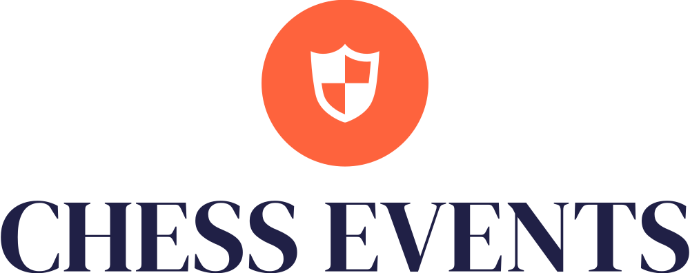

  
  <h2 align="center">Architecture</h2>

## Tech Stack

- **Frontend**:
  - React / React Native
  - TypeScript & Zod
  - Tailwind CSS & Radix

- **Backend**:
  - Remix / Next JS (SSR Framework)
  - Prisma (ORM)
  - Postgres / SQLite (DB)
  - Node (Server)
  - AWS Lambda / Vercel Edge Functions (Serverless)
  - Mailgun (Email / Templating)
  - Strapi (CMS)

## Application Landscape

### Marketing Site (chessevents.io)

A static website for promoting the chess events brand, surfacing some basic content and driving users to sign up to the app in order to explode a full suite of features and functionality

Features:

- Upcoming Events
- Mission Statement
- Donations / Supporter

**Stack**: React, Tailwind CSS

### Core App (app.chessevents.io)

The fully functional application providing authentication via registration, login and magic-link access.

Features:

- Authentication
- Event View / Search / Management / Payment
- Result View / Search / Management
- User Profile
  - User results
  - User ratings
  - User membership

**Stack**: NextJs, Postgres, Prisma, Vercel

### API (api.chessevents.io)

A well documented API offering accessible features used by both the core app and the static marketing site, allow enabling public access.

Features:

- Event
  - list
  - details
  - query
- User
  - list
  - details
  - query
- Rate Limit Access
- API Key Grant Access
- API Key roles
  - Admin (CRUD)
  - Host (CRU of specific events)
  - User (R)

**Stack**: Postgres, Prisma, Express, Vercel